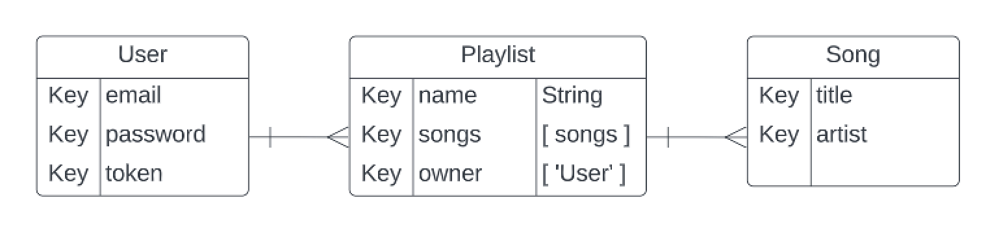

# Jukebox
Queue up your favorite songs in a playlist :musical_note:

## User stories
### MVP
- As a user, I want to create an account.
- As a user, I want to login.
- As a user, I want to create a playlist.
- As a user, I want to add songs to my playlist.
- As a user, I want to view my created playlists.
- As a user, I want to view a selected playlist.
- As a user, I want to edit a single playlist.
- As a user, I want to delete songs from a selected playlist.

### Version 2
- As a user, I want to view others playlists.
- As a user, I want to play the selected song.

### Version 3
- As a user, I want to link this to my Spotify account.
- As a user, I want to make my playlist private or public.

## Wireframes
<figure>
    <figcaption>Wireframes</figcaption>
    
</figure>

## Entity Relationship Diagram (ERD)
<figure>
    <figcaption></figcaption>
    
</figure>
